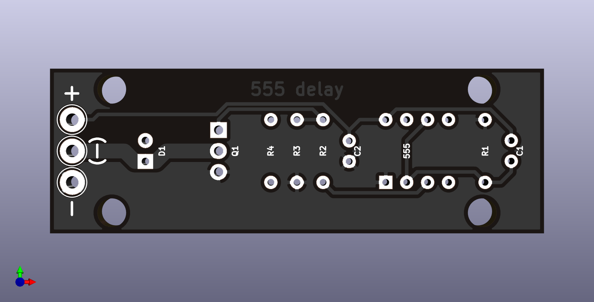

# 555 On-Delay

Delays the power-on of a device. A TO-220 FET is used to switch device GND. Useful e.g. for wide-band O2 controllers.

Traces for source and drain are duplicated on the back layer of the PCB. Wires up to 1.5 mm² (16 AWG) can be soldered to the board. LED negative differs a bit from the schematic.

Dimension: 60 x 20 mm

Mounting hole pattern: 45 x 15 mm (3.5 mm hole diameter)
