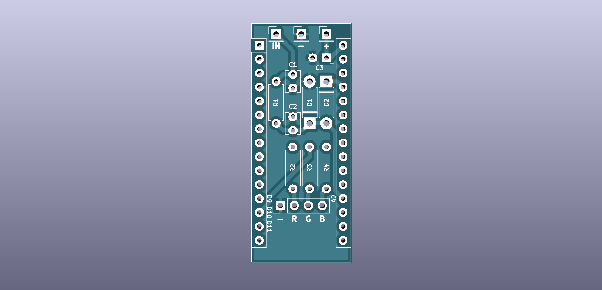

# AFR indicator light

This add-on board for an Arduino Nano facilitates handling of one 0-5 V signal (e.g. from a wide-band O2 controller) going into an ADC (on pin A0) and controlling a common cathode RGB LED (on pins D9, D10, D11).

A separate LED base PCB allows for easy mounting of the indicator LED.

The Arduino sketch currently simply switches between colors (blue, cyan, green, yellow, red) according to the input voltage. Aim is to create an unobtrusive and easy to decode indicator light in case there is no room for a proper analog gauge.
