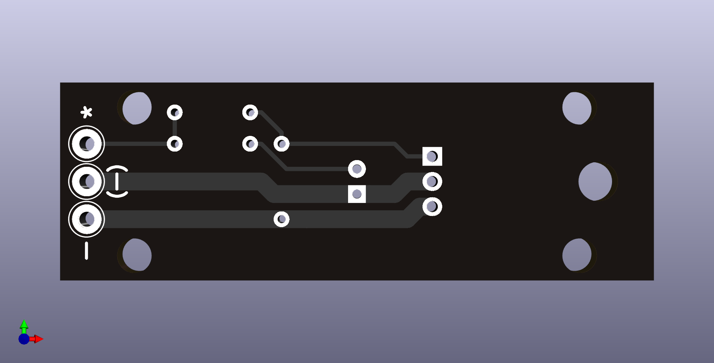

# TO-220 FET Mount

The TO-220 FET can be mounted horizontally.

Traces for source and drain are duplicated on the back layer of the PCB. Wires up to 1.5 mm² (16 AWG) can be soldered to the board.

Dimension: 60 x 20 mm

Mounting hole pattern: 45 x 15 mm (3.5 mm hole diameter)
