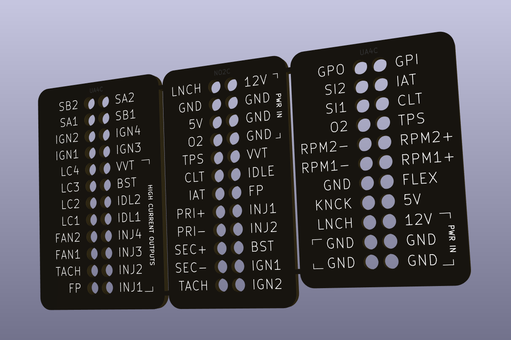

# Cable Management for WTMtronics UA4C and NO2C Speeduino boards

Makes the Speeduino test setup a little more convenient and idiot-proof.

Depending on the PCB manufacturer's capabilities the layout might have to changed a bit.
